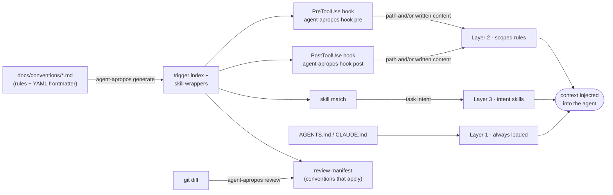

# agent-apropos

**Context injection for AI CLI coding tools — deliver the right documentation at
exactly the right moment.**

*Apropos* — apt, pertinent, timely; said or done at exactly the right moment.
That's the whole design brief: agent-apropos is a single deterministic binary that
keeps a layered documentation structure working. It compiles convention-doc
frontmatter into a trigger index, generates skill wrappers, serves as a hook
handler for supported CLI agents that injects path- and construct-scoped rules
at write time, and resolves the conventions that apply to a diff for review.

One large always-loaded instruction file gets skimmed and forgotten. agent-apropos
keeps the guidance small and just-in-time: rules live in
[`docs/conventions/`](./docs/conventions/) as markdown with YAML frontmatter,
and agent-apropos delivers each one exactly when the file or construct it governs is
being touched — nothing sooner, nothing later. It makes no LLM calls —
triggering is deterministic — and ships as a static Linux / dynamically-linked
macOS binary.

## Supported CLI agents

- **Claude Code** — PreToolUse/PostToolUse hooks, `AGENTS.md`/`CLAUDE.md`, and generated `SKILL.md` wrappers.
- **OpenCode** — `tool.execute.before`/`tool.execute.after` plugin hooks, same root file and generated skills.
- **Gemini CLI** — scoped rules delivered via its `AfterTool` hook (its `BeforeTool` event
  can't inject context, so a rule lands right after the edit rather than before it), `AGENTS.md` via
  `context.fileName`, and generated `.gemini/skills/*/SKILL.md` wrappers.
- **GitHub Copilot CLI** — scoped rules delivered via its `postToolUse` hook (its
  `preToolUse` event can only allow/deny/modify a call, not inject context, so — like Gemini — a rule
  lands right after the edit rather than before it), calling `agent-apropos hook pre`/`post` directly —
  no bridge script — since the binary understands Copilot's own wire dialect (`toolArgs` as a
  JSON-encoded string) and replies in its flat `additionalContext` shape natively. Wired via a
  generated `.github/hooks/agent-apropos.json`; `AGENTS.md` is read automatically. Repo-level hooks
  require a trusted folder, and non-interactive `copilot -p` runs need
  `GITHUB_COPILOT_PROMPT_MODE_REPO_HOOKS=true` set for hooks to fire at all.
- **Codex CLI** — PreToolUse/PostToolUse hooks (its schema supports
  `additionalContext` on both, so rules land before the write, same as
  Claude), `AGENTS.md` read automatically, calling `agent-apropos hook
  pre`/`post` directly via a generated `.codex/hooks.json` — no bridge
  script. Its own file-editing tool, `apply_patch`, can bundle several
  files' Add/Update sections into a single call (unlike every other wired
  agent's one-file-per-call edit tool); the binary parses that patch
  envelope and matches/injects per file. Non-interactive `codex exec` runs
  need `--dangerously-bypass-hook-trust` for a repo's hooks to fire at all
  (a one-time trust review Codex otherwise requires per hook definition).
  Intent-skill wrappers go in a generated `.codex/skills/` — a repo-local
  root distinct from its default `~/.codex/skills`, confirmed live: Codex
  does not pick up `.claude/skills/` on its own the way Copilot does.
- **Cursor CLI** — coming soon.

## Install

Linux and macOS:

```sh
curl -fsSL https://raw.githubusercontent.com/NEXL-LTS/agent-apropos/main/install.sh | sh
```

Windows, from PowerShell:

```powershell
irm https://raw.githubusercontent.com/NEXL-LTS/agent-apropos/main/install.ps1 | iex
```

Either installer resolves the latest release, verifies its SHA256 checksum, and
installs the binary — to `$HOME/.local/bin` on Linux and macOS, or
`%LOCALAPPDATA%\agent-apropos\bin` on Windows. Both honour the same overrides:
`AGENT_APROPOS_BIN_DIR` for the install directory, `AGENT_APROPOS_VERSION` to pin
a tag.

Ships fully static Linux x86_64/arm64 and Windows x86_64 binaries, and
dynamically linked macOS x86_64/arm64 binaries (`install.sh` picks the right one
from `uname -s`/`uname -m`). The macOS binaries depend on nothing beyond system
frameworks — no Homebrew required — since the third-party libs Crystal's stdlib
pulls in are statically linked at build time. Windows arm64 is not shipped yet;
build from source there.

Windows notes: the hook wiring `init` writes is a bare `agent-apropos hook …`
command, which both PowerShell and Git Bash resolve through `PATH` and
`PATHEXT`, so nothing about it is Windows-specific. `init --claude-symlink`
needs permission to create a symlink (Developer Mode, or an elevated shell); it
reports the flag as unavailable and carries on where the OS refuses.

From source (requires [Crystal](https://crystal-lang.org) ≥ 1.20):

```sh
make install          # builds the release binary into $PREFIX/bin (default ~/.local/bin)
```

### Pinning a version in another repo's Dockerfile

```dockerfile
ARG AGENT_APROPOS_VERSION=v0.4.2

RUN curl -fsSL "https://raw.githubusercontent.com/NEXL-LTS/agent-apropos/${AGENT_APROPOS_VERSION}/install.sh" -o /tmp/install.sh \
    && AGENT_APROPOS_VERSION=${AGENT_APROPOS_VERSION} AGENT_APROPOS_BIN_DIR=/usr/local/bin sh /tmp/install.sh \
    && rm /tmp/install.sh

RUN agent-apropos --version
```

## Quickstart

```sh
agent-apropos init                # bootstrap docs/conventions/, hook wiring, .gitignore
$EDITOR docs/conventions/  # write rules (see docs/conventions/README.md)
agent-apropos generate            # compile the index + skill wrappers
agent-apropos lint                # validate the structure
agent-apropos doctor              # check the environment and hook wiring
```

`agent-apropos init` wires hooks for whichever CLI agents are in play. By default it
auto-detects: if `claude` is on PATH it wires two hooks into
`.claude/settings.json` (`agent-apropos hook pre` → PreToolUse, before the
write; `agent-apropos hook post` → PostToolUse, after it);
if `opencode` is on PATH it generates the OpenCode plugin bridge instead (or
as well); if `gemini` is on PATH it wires both `agent-apropos hook pre` and
`agent-apropos hook post` into `.gemini/settings.json`'s `AfterTool` event (Gemini's
`BeforeTool` event has no way to inject context back into the model, so
delivery degrades to firing right after the edit) and points `context.fileName` at
`AGENTS.md`; if `copilot` is on PATH it wires the same two commands into
`.github/hooks/agent-apropos.json`'s `postToolUse` event, for the identical
reason Gemini's does (Copilot's `preToolUse` event can't inject context
either) — no bridge script, since the binary speaks Copilot's own wire
dialect natively; if `codex` is on PATH it wires both commands into
`.codex/hooks.json`'s `PreToolUse`/`PostToolUse` events, matched on Codex's
`apply_patch` tool — Codex's `PreToolUse` *can* inject context, so rules
land before the write here, same as Claude. Pass `--tool claude` /
`--tool opencode` / `--tool gemini` / `--tool copilot` / `--tool codex`
(repeatable) to wire specific agents explicitly regardless of PATH. You never
run the hooks themselves by hand — the agent calls them, and they inject the
matching conventions as context.

Run `agent-apropos help` for the full mental model (also `agent-apropos help --format json` for
the machine-readable form, or `agent-apropos help <command>`).

## Bootstrapping from an existing codebase

Most repos aren't starting from zero — the conventions already exist, just
scattered across a README, a wiki, ADRs, or tribal knowledge in someone's
head. Rather than writing `docs/conventions/` from scratch, have your coding
agent survey what's already there and sort it into the three layers. After
`agent-apropos init`, hand it a prompt along these lines:

```
Read docs/conventions/README.md to learn agent-apropos's three-layer convention
model (root file, scoped rules, intent skills). Then survey
this repo's existing documentation — README, wiki exports, ADRs, code
comments — plus any patterns you can infer from the code itself.

For each distinct convention you find, classify it into exactly one layer
(see "Classifying an instruction" in that doc) and draft it as a new file
under docs/conventions/ (or docs/conventions/workflows/ for Layer 3 skills)
with the right YAML frontmatter, stating what the rule is, why it exists,
and a verification criterion. Only add to AGENTS.md if the convention is
truly universal.

Don't invent conventions that aren't actually followed here — only capture
what's real. List every file you created or changed so I can review it, then
run `agent-apropos generate && agent-apropos lint` and fix anything that's flagged.
```

`agent-apropos init` prints a pointer to this section as a reminder.

### Graduating conventions into tooling

Prose is the *starting* form for a convention, not the final one: once a rule
is well understood, it should graduate into something that enforces itself —
a linter rule (existing or custom) or, for rules about producing new files
rather than restricting existing code, a generator/scaffold. `docs/conventions/`
calls this out as an incubator; movement only goes one direction, from docs
into tooling. Periodically point an agent at the existing rules and ask it to
propose graduations:

```
Read every file in docs/conventions/ (including docs/conventions/workflows/).
For each convention, decide whether it's still a genuine judgment call or
whether it's ready to graduate out of prose:

1. Can an existing linter/formatter already enforce it (a rule that's
   available but not turned on)? Name the linter and the rule.
2. Could it be enforced by a new custom lint rule? Describe what the rule
   would check for.
3. Is it really about scaffolding new files/boilerplate rather than
   restricting existing code (e.g. "new operations must register in the
   dispatch table")? That's a generator candidate, not a lint rule — describe
   what the generator would emit.
4. Otherwise, does it genuinely require judgment that tooling can't capture?
   Leave it as prose.

Treat words like "always", "never", "must", and "must not" as a signal the
rule is a hard, mechanically-checkable constraint — weigh those docs first.

Don't edit or delete anything yourself. List each convention with your
recommendation and reasoning so I can review before we implement the lint
rule or generator and retire the prose it replaces.
```

## How it works

Guidance is organized into three layers, each triggered by the cheapest mechanism
that reliably fires it — see [`docs/conventions/README.md`](./docs/conventions/README.md)
for the full model:



| Layer | For | Trigger | Delivered by |
| --- | --- | --- | --- |
| 1 Root file | Universal rules | Always loaded | `AGENTS.md` |
| 2 Scoped rules | A directory / file type, an API / code construct, or both | A **write** to a matching **path** and/or matching written **content** (regex) | Pre/PostToolUse hooks |
| 3 Intent skills | Task-nature guidance | Semantic skill match | Generated `SKILL.md` |

`agent-apropos generate` compiles the frontmatter in `docs/conventions/` into a cached
trigger index and committed skill wrappers. At write time, the hooks look up the
matching rules and inject them. Reads never inject — the same hook is wired onto
each agent's read tool only so that a convention doc the model reads for itself
is not injected again later. That suppression needs a read that both completed
and covered the whole doc, so read tools are wired on each agent's
post-execution event and a partial (offset/limit) read is ignored. For review, the same frontmatter resolves which
conventions apply to a diff, so review prompts carry zero copies of the rules.

## Configuration

Conventions live in `docs/conventions/` by default — nothing to configure for
the common case. To keep them somewhere else (a monorepo's docs shared across
packages, for instance), drop an `agent-apropos.yml` at the repo root:

```yaml
conventions_dir: ../shared-conventions   # relative to repo root, or absolute
```

Every command that reads conventions (`generate`, `hook`, `lint`, `match`,
`review`, `doctor`) and `init`'s own scaffolding follow this. Scoped-rule hook delivery
works identically regardless of where the docs live. Intent-skill wrappers
inline the doc's full body instead of the usual lightweight pointer whenever
the source resolves outside the repo — a model can't be relied on to follow a
pointer to a path outside its own workspace tree, so the wrapper carries the
content directly instead.

A `conventions_dir` that resolves outside the repo root — an absolute path,
or enough `../` to walk out of the tree — is refused unless you pass
`--allow-outside-repo` to that command. This isn't just an authoring
convenience gate: `agent-apropos.yml` ships inside the repo, so without it, a
repo you've just cloned (and not yet reviewed) could steer `init`'s scaffold
writes to a path of its own choosing outside your project. Pass the flag once
you've confirmed the setting is legitimate; `init` remembers it by baking it
into the hook commands it wires, so you don't need to pass it again for that
repo's hooks to keep working.

## Commands

| Command | Purpose |
| --- | --- |
| `agent-apropos init` | Bootstrap the convention structure into a repo (idempotent; `--tool claude\|opencode\|gemini` — repeatable, auto-detects by default — plus `--force`, `--example`, `--claude-symlink`, `--dry-run`). |
| `agent-apropos generate` | Compile frontmatter into the trigger index and skill wrappers. `--check` is the CI drift gate. |
| `agent-apropos hook pre` / `hook post` | Hook handlers for the wired CLI agent (scoped rules, before / after the write). Fail open — never block an edit. |
| `agent-apropos match <paths>` | Resolve the conventions applying to given files (`--format paths\|json\|full`). |
| `agent-apropos review [range]` | Resolve conventions for a git diff range as a review manifest (`--format md\|json`). |
| `agent-apropos lint` | Validate frontmatter, skill descriptions, `paths` globs that match no tracked file, root-file budget, and generated-artifact freshness (`--strict`). Per-doc opt-out: `lint: ignore`. |
| `agent-apropos doctor` | Check hook wiring, agent version/capability support, index freshness, and cache writability. |
| `agent-apropos help` | The dual-audience mental model (human and agent), single-sourced with `--format json`. |

Every command takes `--help`, `--repo-root <dir>` (default: walk up to the nearest
`.git`), and documents its exit codes.

## Design guarantees

- **Fast hooks.** `hook pre`/`hook post` complete in well under 50 ms warm (index
  present); the hot path never parses YAML. A benchmark spec guards the budget.
- **Deterministic output.** `generate` is byte-stable across runs and platforms
  (sorted walks, LF endings, no timestamps) — the prerequisite for `--check`.
- **Fail-open hooks, fail-closed CI.** A hook never blocks or breaks an edit; on
  any internal error it exits 0 and emits nothing. `generate --check` and `lint`
  exit non-zero on any violation.
- **No runtime dependencies.** A fully static musl binary on Linux; on macOS,
  where a fully static binary isn't possible, the third-party libs are
  statically linked so only system frameworks are needed. The only shell-out
  off the hook path is optional `git` for `review`.

## Non-goals (v1)

- No Cursor `.mdc` / Copilot `.instructions.md` output — the frontmatter is
  designed so these are pure additional emitters later.
- No enforcement of code style — that belongs in linters/formatters, which agent-apropos
  does not replace.
- No LLM calls; no daemon/watch mode (every invocation is a fast one-shot).
- No hook management beyond its own entries: agent-apropos edits only the hook entries it
  owns in `.claude/settings.json`, marked and idempotent.

## Roadmap

Windows arm64; package-manager distribution (WinGet, Scoop, an npm wrapper);
`--redup-after N` for re-injecting a rule every N edits;
Cursor/Copilot emitters from the same frontmatter; advisory lint-rule linkage
(teaching messages that cite rule files); a `review` posting mode for CI (GitHub
PR comments).

## Development

This repo dogfoods the standard on itself — `docs/conventions/` holds agent-apropos's own
scoped guidance, delivered by agent-apropos's own hooks. Use `make`:

- `make deps` — install shard and npm dependencies
- `make build` — build the debug binary; `make release` for the release build
- `make install` — build and install to `$PREFIX/bin` (default `$HOME/.local`)
- `make check` — lint + spec + dup + the shell suites (the fast local gate)
- `make coverage` — specs under kcov with the 100% line-coverage gate
- `make mutate` — the mutation gate on the lines you changed (blocking in CI)

Development is spec-first, coverage is 100%, ameba runs zero-findings, and a
surviving mutant on a changed line fails the build. See
[`AGENTS.md`](./AGENTS.md) and [`docs/conventions/`](./docs/conventions/).

## License

[MIT](./LICENSE).
