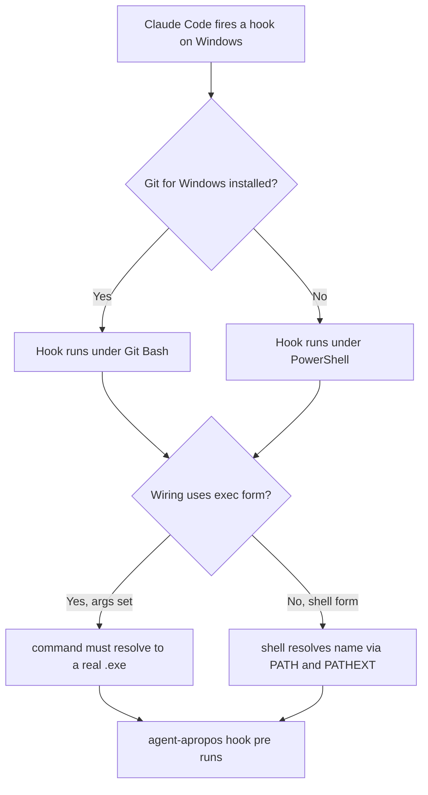
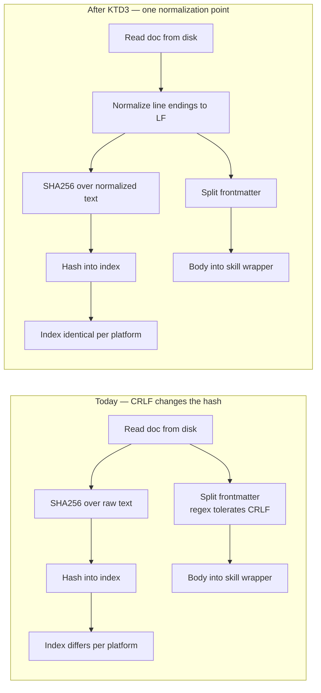
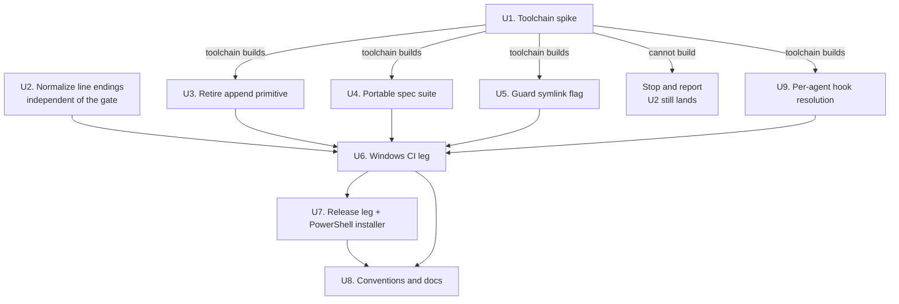

# Windows Support - Plan

## Goal Capsule

- **Objective:** A Windows user installs agent-apropos and gets conventions injected into their native Windows CLI agent, with the same behavior Linux and macOS users already get.
- **Means:** Remove the codebase's only POSIX-only primitive rather than porting it, and add a Windows CI leg that builds the binary and runs the spec suite (KTD2, KTD1).
- **Product authority:** End users running agent-apropos on Windows. Windows as a *development* environment is not active scope — contributors continue on Linux and macOS.
- **Execution profile:** Sequential, gated. U1 is a throwaway spike whose outcome decides whether the rest of the plan proceeds.
- **Stop conditions:** Stop and report if U1 shows the Crystal Windows toolchain cannot build this codebase. Stop and report if a Tier 3 standard-library gap blocks a requirement rather than merely complicating it. Do not work around a missing stdlib capability by adding a platform branch — that contradicts R2.
- **Tail ownership:** This plan ends at a green Windows CI leg and a released binary. Package-manager distribution is a separate deliverable.
- **Open blockers:** None. Open Questions are all non-blocking.

---

## Product Contract

**Product Contract preservation:** changed: R6 — the symlink flag now declines on the OS capability rather than on the platform, so a Windows machine with Developer Mode enabled still gets a real symlink; user-approved during plan review, with AE3 narrowed to the refused case and AE5 added for the permitted one. R1 reworded to match. Also restructured, no scope change: R13 reduced from a two-outcome requirement ("retired or rewritten") to a single intent, with the fork resolved in KTD6. No R-ID was split, renumbered, or repointed.

### Summary

Ship a native Windows x86_64 binary, verified by a CI leg that builds it and runs the spec suite. Retire the one POSIX-only primitive so no compile-time platform branch is ever added, fix a cross-platform determinism defect the port exposes, and give Windows an install path that does not need a POSIX shell.

### Problem Frame

Windows has sat on the roadmap in `README.md` and `install.sh` since the project started, and the release workflow carries a commented-out Windows leg annotated *"Crystal Windows support is Preview — no production promise"*. The deferral was reasoned, not lazy: `docs/conventions/platform-flags.md` forbids compile-time branches for platforms CI cannot build and spec, because the compiler discards the untaken branch before kcov measures it, so an unverified branch is invisible to the 100% line-coverage gate rather than caught by it.

What changed is where the agents are. Claude Code runs natively on Windows 10 1809+ with signed `win32-x64` binaries and a PowerShell/CMD installer; WSL 2 is one option among three, chosen for Linux toolchains or sandboxing. Codex CLI dropped its WSL2 requirement in March 2026. GitHub Copilot CLI lists Windows as a first-class install target. A Windows user running Claude Code natively against `C:\projects\foo` has hooks firing in Windows process space with Windows paths, so a Linux binary inside WSL is unreachable to them — the documentation-only answer covers nobody who follows the vendor's own recommended setup.

No user has reported being blocked. This work is roadmap-driven and accessibility-driven, and that shapes how much verification burden is proportionate.

### Key Decisions

- **Windows is a CI-verified target, not a development environment.** Development, coverage, mutation testing and the bats suites stay on Linux and macOS. (session-settled: user-directed — chosen over also supporting Windows contributors: the user wants development to keep happening on Linux with only CI doing the Windows part.)
- **The verification bar is build plus the spec suite.** (session-settled: user-directed — chosen over build-plus-`--version`, over adding a live hook smoke test, and over shipping now with specs later: the spec run is the cheap step that converts "Crystal abstracts paths" from an expectation into evidence.) Governs R12, R14.
- **Retire the append primitive instead of branching per platform.** (session-settled: user-directed — chosen over per-platform `flag?(:win32)` branches and over a Windows subset build: adding no branch keeps `docs/conventions/platform-flags.md` true as written rather than requiring it to be rewritten to permit what it was authored to prevent.) Governs R2, R5, R13.
- **Windows x86_64 only in the first release leg.** Matches the existing roadmap comment in `.github/workflows/release.yml`; arm64 is deferred, not rejected. Governs R7.
- **`init --claude-symlink` degrades where the OS refuses a symlink, rather than being emulated or blocked by platform.** A junction or file copy would each be a different thing wearing the same flag's name; keying on the actual capability means a Windows machine with Developer Mode enabled still gets a real symlink, and no platform branch is needed. (session-settled: user-approved — chosen over declining on all Windows unconditionally: capability detection needs no platform test and serves the machines that can do it.) Governs R6.

<!-- ce-section: work-relationships -->
### How This Work Fits Together

This plan owns one area: Windows as a runtime target for people using agent-apropos. The breakdown below is how the surrounding work is currently understood, not a committed roadmap — a later plan may revise, split, merge or discard any of it.

- Package-manager distribution (WinGet, Scoop, npm)
  - Depends on this plan for a Windows binary to package.
  - Can proceed independently of it for the macOS and Linux entries, which need no new artifact.
  - Enables the broader "easy for anyone to use" goal more directly than platform coverage does.
- Windows as a contributor environment
  - Depends on this plan, which establishes the toolchain and CI leg.
  - Still to decide whether it is wanted at all; this plan's scope excludes it.
- Gemini CLI's migration to Antigravity CLI
  - Can proceed independently of this plan.
  - Shares the underlying question of which agent CLIs are worth wiring.

### Requirements

**Runtime parity**

- R1. Every agent-apropos command and flag available on Linux is available on Windows, subject only to the OS capability R6 names.
- R2. `src/` contains no compile-time platform branch (`flag?(:...)`) once this work lands.
- R3. `generate` output is byte-identical across Windows, Linux and macOS for identical repository content, regardless of the line endings the checkout produced.
- R4. Hook path matching treats a Windows-style absolute path supplied by an agent as equivalent to its POSIX form.
- R5. `--verbose` hook logging works on Windows.
- R6. `init --claude-symlink` reports the flag as unavailable and exits successfully wherever symlink creation is not permitted, leaving no partial state.

**Distribution**

- R7. Each release attaches a Windows x86_64 binary with a published SHA256 checksum, matching the existing Linux and macOS legs.
- R8. Windows has a documented install path that requires no POSIX shell.
- R9. `install.sh` detects a Windows-hosted POSIX shell (MinGW, MSYS, Cygwin) and names the Windows install path, instead of the current generic unsupported-OS error.

**Hook wiring**

- R10. `init` produces Claude Code hook wiring that fires on native Windows whether or not Git for Windows is installed.
- R11. `doctor` reports accurately on Windows, including whether the binary resolves on PATH.

**Verification and documentation**

- R12. CI has a Windows leg that builds the release binary and runs the spec suite to a pass.
- R13. `docs/conventions/filesystem-append.md` no longer governs a primitive that does not exist.
- R14. `docs/conventions/platform-flags.md` reflects that Windows now has a CI leg, without relaxing its prohibition on unverified platform branches.
- R15. `README.md` and `install.sh` stop describing Windows as roadmap-only.

### Key Flows

- F1. A Windows user goes from nothing to an injected convention
  - **Trigger:** A developer on native Windows, running Claude Code in PowerShell or CMD, wants scoped conventions in a repo on a Windows drive.
  - **Steps:** They install agent-apropos through the Windows install path (R8). They run `agent-apropos init`, which detects the agent CLIs present and writes hook wiring that will fire under whichever shell Claude Code selects (R10). They run `agent-apropos generate` to compile the index. They edit a file the conventions govern; the hook fires, matches the path, and injects the rule.
  - **Outcome:** The rule reaches the model before or after the write, per the agent's hook capabilities, exactly as on Linux.
  - **Covered by:** R1, R4, R8, R10

The one branch point in F1 that has no Linux analogue is which shell executes the hook command, and it is decided by machine state rather than by anything `init` can observe at wiring time:

### Acceptance Examples

- AE1. Line endings do not change generated output
  - **Covers R3.**
  - **Given:** A repository checked out on Windows with Git's default `core.autocrlf=true`, so convention docs are on disk with CRLF.
  - **When:** `agent-apropos generate` runs, and the same command runs against the same content on Linux.
  - **Then:** Both produce an identical trigger index, and `agent-apropos generate --check` reports no drift on either platform.

- AE2. A Windows path matches a POSIX glob
  - **Covers R4.**
  - **Given:** A convention scoped to `src/**/*.cr`.
  - **When:** An agent reports editing `C:\projects\foo\src\bar.cr`.
  - **Then:** The convention matches and is injected.

- AE3. The symlink flag declines cleanly where the OS refuses
  - **Covers R6.**
  - **Given:** A Windows user without Developer Mode runs `agent-apropos init --claude-symlink`, so symlink creation is not permitted.
  - **When:** `init` reaches the symlink step.
  - **Then:** It reports the flag as unavailable, completes the rest of `init` normally, and exits zero without creating a partial or substitute link.

- AE5. The symlink flag still works where the OS permits it
  - **Covers R6.**
  - **Given:** A Windows user with Developer Mode enabled runs `agent-apropos init --claude-symlink`.
  - **When:** `init` reaches the symlink step.
  - **Then:** The symlink is created, exactly as on Linux and macOS.

- AE4. A Windows-hosted POSIX shell gets a useful error
  - **Covers R9.**
  - **Given:** A user pipes `install.sh` to `sh` inside Git Bash on Windows.
  - **When:** The platform gate evaluates `uname -s` and sees a `MINGW64_NT`-style value.
  - **Then:** The message names the Windows install path, rather than reporting the OS as unsupported.

### Success Criteria

- A Windows user reaches an injected convention without reading source or issue threads.
- The Windows CI leg fails on a real Windows-only regression rather than only on a build break — AE1 is the reference case, since it passes a `--version` check and fails a spec run.
- The conventions that blocked this work still describe the codebase accurately once it lands, per R13 and R14.

### Scope Boundaries

- Windows as a development environment. `make check`, kcov coverage, the bats suites, jscpd and mutation testing stay on Linux and macOS.
- Package-manager distribution — WinGet, Scoop, an npm wrapper. This is the larger lever on "easy for anyone to use" and is the natural sequel, with its own acceptance criteria.
- Windows arm64. Deferred behind x86_64, not rejected.
- The live `e2e` suite on Windows. It needs real credentials and is already outside CI.
- Gemini CLI's Windows behavior. Google ended consumer authentication in June 2026 and is migrating users to Antigravity CLI; that decay deserves its own assessment rather than a fix folded in here.

#### Deferred to Follow-Up Work

- Windows arm64 release leg, once x86_64 is stable.
- A live-agent hook smoke test on Windows — driving a real Claude Code session through `init` and an actual edit under PowerShell. Considered as a verification bar and not chosen; it becomes cheap once the CI leg exists. This is distinct from the subprocess round-trip U9 verifies, which invokes the binary directly and is in scope.

### Dependencies / Assumptions

- Crystal rates `x86_64-windows-msvc` **Tier 3** — its lowest tier, defined as "partially works" with "significant limitations… typically incomplete standard library support". Tier 1 is Linux and macOS only. This is the plan's largest risk and the reason U1 exists.
- `LibC::O_NOFOLLOW` is absent from Crystal's `x86_64-windows-msvc` bindings and `fun open` is bound only in the Unix trees, so the current `append` cannot compile on Windows. Verified against the local Crystal 1.20 source tree.
- GitHub-hosted Windows runners are assumed available and to ship Git, which the integration specs shell out to.
- `crystal-lang/install-crystal` supports Windows runners and is CI-tested against `windows-latest`. This repo already pins that action at `v1.9.2`.
- Whether a Windows build can or should be statically linked is unresolved; U1 answers it. The Linux legs use static musl and the macOS legs link system frameworks dynamically, so either outcome has an existing precedent to mirror. The toolchain choice itself is settled in KTD7.
- No user has requested Windows support. The demand is inferred from the roadmap and from the CLI agents having moved to native Windows.
- GitHub's own documentation lists Copilot CLI as supporting native Windows with PowerShell 6+; secondary sources describe native PowerShell as experimental. The official position is taken as the plan of record and the discrepancy is unresolved.
- Nothing outside this repository is assumed to read `.cache/agent-apropos/log`. Only this repository was checked.

---

## Planning Contract

### Key Technical Decisions

- KTD1. **Prove the toolchain before porting anything.** U1 is a throwaway spike that builds the current tree on a Windows runner and reports what fails. Crystal's Tier 3 rating makes "port first, discover the gap last" the expensive ordering. Governs sequencing; the gate is stated in the Goal Capsule's stop conditions.
- KTD2. **Replace the shared append-only log with one file per hook invocation, written through the existing atomic temp-plus-rename path, and pruned by age.** This removes the primitive rather than porting it. `SessionState.prune` is the existing precedent for age-based cleanup of a cache directory. (session-settled: user-directed — chosen over per-platform `flag?(:win32)` branches and over a Windows subset build: adding no branch keeps `docs/conventions/platform-flags.md` true as written.) Covers R2, R5.
- KTD3. **Normalize line endings when a convention doc is read, not only through repo line-ending policy.** A `.gitattributes` entry fixes this repository; it does not fix the consumer repositories agent-apropos runs inside, where the tool controls nothing. Normalizing at read makes the hash, the parsed frontmatter, and the rendered body all LF-based on every platform. Governs R3.
- KTD4. **Keep the shell-form hook commands as they are; verify rather than change.** The Claude, Codex, Copilot and Gemini emitters produce a bare command string with no `args` array, which both Git Bash and PowerShell resolve to `agent-apropos.exe` through PATH and PATHEXT. Exec form would require naming a real `.exe`, which breaks the Linux and macOS wiring. Governs R10; scoped to the four shell-form emitters, with OpenCode covered by KTD8.
- KTD5. **Point the environment-adapter spec at `git` instead of `sh`.** The integration specs already require `git` on the runner, so it is the one external command guaranteed present on all three platforms. This keeps the spec suite free of a platform branch, which a `flag?`-guarded spec would reintroduce. Covers R12.
- KTD6. **Delete `docs/conventions/filesystem-append.md` rather than rewriting it.** Its entire subject is a primitive that will not exist; a rewritten doc governing nothing is worse than no doc. The `platform-flags.md` prohibition it cross-references survives on its own. Covers R13.
- KTD7. **Target `x86_64-windows-msvc`, not the GNU variant.** MSVC is Crystal's primary Windows toolchain, it is the variant whose standard-library bindings this plan already inspected for the `append` incompatibility, and `install-crystal` no longer needs to provision an MSVC environment on the runner. Governs R7, R12.
- KTD8. **Treat OpenCode's generated plugin as a separate resolution path from the four shell-form emitters.** It spawns an argument array from JavaScript rather than emitting a shell command, so PATHEXT resolution is not inherited from a shell and must be confirmed on Windows independently. Any fix belongs in the generated plugin's spawn call at runtime, not in a compile-time platform branch, so R2 holds. Covers R1, R10.

### High-Level Technical Design

**Where the line-ending defect lives, and where KTD3 fixes it.** Frontmatter parsing already tolerates CRLF; hashing does not. The fix moves normalization upstream of the split so every downstream consumer sees LF.

**Unit sequencing and the U1 gate.** Only U2 is independent of the spike, because the line-ending defect is a real cross-platform bug that is worth landing whether or not Windows ships.

### Assumptions

- The spec suite's remaining 33 files are platform-neutral. Only `spec/agent_apropos/environment_spec.cr` and `spec/agent_apropos/filesystem_spec.cr` were found to carry real POSIX coupling; the rest use the in-memory filesystem double or portable `Process.run` plus `File.tempname`.
- `Process.run` with `chdir` (used by the git adapter) and `Dir.glob` behave equivalently on Windows. Tier 3 makes this an assumption rather than a fact; U1 tests it.

### Sequencing

U1 gates everything except U2. U2 may land first and independently. U6 requires U2, U3, U4, U5 and U9 complete. U7 follows a green U6. U8 closes out documentation once the behavior it describes exists.

### System-Wide Impact

- **Five agent surfaces, two resolution mechanisms.** `init` emits wiring for Claude, Codex, Copilot, Gemini and OpenCode. The first four share one shell-form mechanism (KTD4); OpenCode's generated plugin spawns an argument array from JavaScript (KTD8). Windows is the first platform where those two mechanisms can diverge, so parity is verified per-agent in U9 rather than assumed from the Claude case.
- **A behavior change on platforms that already work.** Retiring the append primitive changes the verbose log from one appended file to a pruned directory of per-invocation files, on Linux and macOS as well as Windows. Anything tailing the old path stops seeing new lines. No in-repo consumer was found, but external consumers cannot be ruled out.
- **The coverage gate moves with the code.** Deleting `append` removes lines the 100% gate currently counts, and the replacement adds new ones. Coverage must be re-established, not assumed to carry over.
- **Line-ending normalization reaches every consumer repo.** KTD3 changes hashing behavior for every repository agent-apropos runs in, not only this one. The effect is a one-time local index regeneration; `.cache/` is gitignored here, so nothing tracked changes.

### Risks & Dependencies

| Risk | Likelihood | Mitigation |
|---|---|---|
| Crystal's Tier 3 Windows stdlib blocks a requirement outright | Moderate | U1 spikes before any port work; the Goal Capsule's stop conditions make this a report-and-halt, not a workaround |
| A Tier 3 gap tempts a `flag?(:win32)` workaround | Moderate | R2 forbids it and the stop conditions name it explicitly; a blocked requirement is escalated rather than branched around |
| OpenCode's plugin cannot resolve the binary on Windows | Moderate | U9 verifies it directly; any fix stays in the generated plugin's runtime spawn, per KTD8 |
| An external consumer depends on the old verbose log path | Low | Call the change out in the release notes; the flag is documented as best-effort debugging output, not a stable interface |
| Windows CI runtime slows the PR feedback loop | Low | The leg omits coverage, duplication and bats; if it still drags, it can move to merge-queue-only without weakening the bar |
| Crystal version drift between the devcontainer and CI | Low | The devcontainer installs latest-stable while CI pins a version; U6 pins the Windows leg to the same version the Linux job uses |

### Open Questions

**Deferred to Implementation**

- Whether Tier 3 standard-library gaps exist beyond the known `append` incompatibility. U1 answers this; it cannot be resolved from documentation.
- Whether the Windows binary should be statically linked. U1's linkage findings decide it, mirroring whichever existing leg fits.
- Whether OpenCode's plugin needs an explicit executable extension on Windows. U9 answers it against a real runner.

---

## Implementation Units

### U1. Prove the Crystal Windows toolchain

- **Goal:** Establish whether Crystal can build this codebase on a Windows runner, and enumerate exactly what fails.
- **Requirements:** Unblocks R12; informs the static-vs-dynamic linkage assumption.
- **Dependencies:** None.
- **Files:** `.github/workflows/ci.yml` (temporary job, removed before merge).
- **Approach:**
  1. Add a throwaway `workflow_dispatch` job on `windows-latest` using the already-pinned `crystal-lang/install-crystal` action at the repo's Crystal version.
  2. Run `shards install`, then `crystal build src/agent_apropos.cr` and capture every compile error verbatim.
  3. Run `crystal spec` and capture failures separately from compile errors.
  4. Record whether a static link is possible, and what the produced binary links against.
  5. Report findings; do not fix anything in this unit.
- **Execution note:** This is a diagnostic spike. Its deliverable is a findings report, not shipped code. Remove the temporary job before merging. If the toolchain cannot build the tree at all, stop the plan here and report rather than working around it.
- **Test scenarios:** `Test expectation: none -- throwaway diagnostic spike; the deliverable is a findings report, and the temporary CI job is deleted before merge.`
- **Verification:** A written list of compile errors and spec failures exists, each attributed to a known cause (the `append` primitive, a Tier 3 stdlib gap, or something unanticipated).

### U2. Normalize line endings when reading convention docs

- **Goal:** Make `generate` output identical regardless of the line endings a checkout produced.
- **Requirements:** R3, AE1. Implements KTD3.
- **Dependencies:** None. Lands independently of the U1 gate.
- **Files:** `src/agent_apropos/conventions.cr`, `spec/agent_apropos/conventions_spec.cr`, `spec/integration/generate_spec.cr`, `.gitattributes` (new).
- **Approach:**
  1. Normalize CRLF and lone CR to LF at the point a convention doc's text enters `Convention.parse`, before both the hash and the frontmatter split.
  2. Add a `.gitattributes` pinning text files to LF so this repository's own checkouts stay consistent — belt and braces alongside the read-time fix, not a substitute for it (KTD3).
  3. Leave the frontmatter fence regexes as they are; they already tolerate CRLF and remain correct against normalized input.
- **Patterns to follow:** `src/agent_apropos/conventions.cr:19` is the single construction point for a `Convention`, so one normalization there covers hash, frontmatter and body.
- **Test scenarios:**
  - Covers AE1. A doc whose bytes use CRLF produces the same hash as the byte-equivalent LF doc.
  - A doc using CRLF produces the same parsed frontmatter fields as the LF equivalent.
  - A doc using CRLF produces a byte-identical rendered skill wrapper to the LF equivalent.
  - A doc containing a lone CR is normalized rather than left as-is.
  - A doc with mixed CRLF and LF sections normalizes to all-LF.
  - `generate --check` reports no drift when the working tree is CRLF and the index was generated from LF content.
- **Verification:** Generating from a CRLF checkout and an LF checkout of the same content yields byte-identical index and wrapper output.

### U3. Retire the append primitive

- **Goal:** Remove the POSIX-only `append` and deliver `--verbose` hook logging through a portable mechanism.
- **Requirements:** R2, R5. Implements KTD2.
- **Dependencies:** U1.
- **Files:** `src/agent_apropos/filesystem.cr`, `src/agent_apropos/hook.cr`, `spec/agent_apropos/filesystem_spec.cr`, `spec/agent_apropos/hook_spec.cr`, `spec/support/in_memory_fs.cr`.
- **Approach:**
  1. Delete `append` from the `Filesystem` abstract class and its `Real` implementation, along with the `LibC` open and the `O_NOFOLLOW` error handling.
  2. Change the verbose hook log to write one file per invocation into the existing log directory, through the existing atomic `write`.
  3. Add age-based pruning for that directory, mirroring the existing session-state prune.
  4. Remove `append` from the in-memory filesystem double and update its users.
- **Patterns to follow:** `SessionState.prune` for age-based cleanup over a globbed cache directory; `Filesystem::Real#write` for the atomic temp-plus-rename write.
- **Test scenarios:**
  - A verbose hook invocation writes a log entry that is readable afterwards.
  - Two invocations in the same session both persist, without overwriting one another.
  - A log file older than the retention window is pruned; one inside the window is kept.
  - A hook invocation whose log write fails still exits zero and emits nothing, preserving fail-open behavior.
  - The filesystem double no longer exposes `append`, and no caller references it.
- **Verification:** `grep` finds no `O_NOFOLLOW` or `LibC.open` in `src/`; verbose logging still produces readable output on Linux.

### U4. Make the spec suite portable and prove Windows path handling

- **Goal:** Let the existing suite run green on a Windows runner, and add explicit coverage for Windows-shaped paths.
- **Requirements:** R4, R11, R12, AE2. Implements KTD5.
- **Dependencies:** U1.
- **Files:** `spec/agent_apropos/environment_spec.cr`, `spec/agent_apropos/hook_spec.cr`, `spec/agent_apropos/doctor_spec.cr`.
- **Approach:**
  1. Replace the `sh` and `sh -c` probes in the environment-adapter spec with `git` equivalents, per KTD5.
  2. Update the stale comment asserting `sh` is present on every CI image.
  3. Add coverage that a Windows-style absolute path relativizes and matches a POSIX glob, exercising the existing normalization rather than adding new normalization.
  4. Confirm the doctor PATH check has coverage that does not assume an extensionless executable name.
- **Patterns to follow:** `src/agent_apropos/hook.cr:213` already relativizes and converts to POSIX form; the new coverage proves that path, it does not duplicate it.
- **Test scenarios:**
  - Covers AE2. A backslash-separated absolute path inside the repo root matches a convention scoped with a forward-slash glob.
  - A backslash-separated path outside the repo root is rejected as outside, exactly as its POSIX equivalent is.
  - A mixed-separator path resolves the same as the fully-backslashed form.
  - The environment adapter resolves an executable that exists and returns nil for one that does not.
  - The environment adapter captures stdout on success and returns nil on a non-zero exit, using the portable command.
  - The doctor PATH check reports found and not-found states without assuming a file extension.
- **Verification:** `make spec` passes on Linux with no `sh` dependency remaining in the suite.

### U5. Guard the symlink flag where the OS refuses it

- **Goal:** Make `init --claude-symlink` decline cleanly wherever symlink creation is not permitted, rather than failing.
- **Requirements:** R6, AE3, AE5.
- **Dependencies:** U1.
- **Files:** `src/agent_apropos/init.cr`, `src/agent_apropos/filesystem.cr`, `spec/agent_apropos/init_spec.cr`.
- **Approach:**
  1. Attempt the symlink and treat a refusal from the OS as the unsupported case; report it on stdout with the rest of the init output.
  2. Complete every other init step normally and exit zero.
  3. Key the behavior on the capability, never on the platform — a Windows machine with Developer Mode enabled gets a real symlink.
- **Execution note:** R2 forbids a `flag?(:win32)` branch, and the decision governing R6 forbids a runtime platform test as well. Handle this as the outcome of attempting the operation, not as any form of "am I on Windows" check.
- **Patterns to follow:** `src/agent_apropos/init.cr:156` is the single call site; the existing dry-run path shows how init reports a step it did not perform.
- **Test scenarios:**
  - Covers AE3. When symlink creation is refused, init reports the flag as unsupported and exits zero.
  - When symlink creation is refused, no partial link or substitute file is left behind.
  - Every other init step still runs and reports normally in that case.
  - Covers AE5. Where symlink creation is permitted, behavior is unchanged and the link is created — this must hold on Windows too, not only on Linux.
  - The dry-run path still creates nothing and reports the same way.
- **Verification:** Linux behavior is unchanged; the unavailable path is covered by spec without a compile-time platform branch.

### U9. Confirm hook-command resolution for every wired agent on Windows

- **Goal:** Establish that the wiring `init` emits actually resolves the binary on Windows, for all five wired agents rather than for Claude alone.
- **Requirements:** R1, R10. Implements KTD4 and KTD8.
- **Dependencies:** U1.
- **Files:** `src/agent_apropos/agents/opencode.cr`, `spec/agent_apropos/agents/opencode_spec.cr`, `spec/integration/lifecycle_spec.cr`.
- **Approach:**
  1. Confirm the four shell-form emitters need no change, since PATH and PATHEXT resolve a bare command name under both Windows shells (KTD4).
  2. Determine whether the generated OpenCode plugin's argument-array spawn resolves an extensionless name on Windows (KTD8).
  3. If it does not, make the generated plugin resolve the executable at runtime — not through a compile-time platform branch, which R2 forbids.
  4. Extend the lifecycle integration coverage so each emitter's wiring is asserted to reference a resolvable command, not merely the expected string.
- **Execution note:** The failure this unit guards against is silent: wiring that looks correct in a config file but never fires. Prefer evidence that the command resolves over evidence that the string was written.
- **Patterns to follow:** `src/agent_apropos/agents/agent.cr:10` defines the shared command prefix all emitters build on; the existing lifecycle specs show the per-agent round-trip shape.
- **Test scenarios:**
  - Each of the five emitters writes wiring whose command references the binary by the shared prefix.
  - The OpenCode plugin's spawn target resolves on a platform where executables carry an extension.
  - The OpenCode plugin's spawn target still resolves where they do not, so Linux and macOS are unaffected.
  - A hook invocation through the generated OpenCode plugin reaches the binary and returns injected context.
  - Wiring emitted for an agent whose binary is absent from PATH fails without breaking the edit, preserving fail-open behavior.
- **Verification:** Every wired agent's emitted command resolves the binary on the Windows runner, evidenced by a subprocess round-trip that invokes the binary directly rather than by string comparison alone. Driving a real agent CLI is the deferred live-agent smoke test, not this unit.

### U6. Add the Windows CI leg

- **Goal:** Build the release binary and run the spec suite on Windows in CI, on every pull request.
- **Requirements:** R12, and the parity umbrella R1. Exercises F1 end-to-end, together with U9.
- **Dependencies:** U1, U2, U3, U4, U5, U9.
- **Files:** `.github/workflows/ci.yml`.
- **Approach:**
  1. Add a `windows-latest` job using the already-pinned `crystal-lang/install-crystal` action at the same Crystal version the Linux job uses.
  2. Run `shards install`, the release build, a `--version` smoke check, and `crystal spec`.
  3. Do not run kcov coverage, jscpd, or the bats suites on this leg — those stay Linux-only per the scope boundary.
  4. Keep the existing Linux job unchanged and authoritative for the coverage gate.
- **Execution note:** This is CI configuration; the proof is the leg going green against the units above, not new unit tests.
- **Patterns to follow:** The existing `test` job's action pinning and step ordering; the release workflow's smoke-test step shape.
- **Test scenarios:** `Test expectation: none -- CI configuration with no application behavior; U2 through U5 and U9 carry the behavioral coverage this leg executes.`
- **Verification:** The Windows job passes on a pull request, and fails when the U2 line-ending fix is reverted.

### U7. Add the Windows release leg and PowerShell installer

- **Goal:** Publish an installable, checksummed Windows binary.
- **Requirements:** R7, R8, R9, AE4.
- **Dependencies:** U6.
- **Files:** `.github/workflows/release.yml`, `install.ps1` (new), `install.sh`.
- **Approach:**
  1. Add a `build-windows` job mirroring the existing legs: build, verify linkage per U1's finding, smoke test, checksum, upload artifact, attach to release on a tag.
  2. Remove the commented-out roadmap leg it replaces.
  3. Add a PowerShell installer that resolves the latest release, verifies the SHA256, and installs to a per-user location, mirroring `install.sh`'s environment-variable overrides.
  4. Extend `install.sh`'s platform gate so a `MINGW*`, `MSYS*`, or `CYGWIN*` `uname -s` names the PowerShell install path instead of reporting an unsupported OS.
- **Execution note:** Mostly packaging. Prefer install and runtime smoke verification over unit coverage — mirror the existing legs' self-test step that runs the installer against the freshly built artifact over a `file://` URL.
- **Patterns to follow:** The `build-macos` job's checksum, smoke-test, artifact-upload and release-attach steps; `install.sh`'s existing platform gate, downloader and checksum-verifier structure.
- **Test scenarios:**
  - Covers AE4. `install.sh` under a `MINGW64_NT` `uname -s` names the Windows install path and does not report the OS as unsupported.
  - `install.sh` on Linux and macOS is unaffected and still resolves its existing assets.
  - The PowerShell installer rejects a binary whose checksum does not match.
  - The PowerShell installer honors the install-directory and version overrides that `install.sh` supports.
  - The release leg's installer self-test installs and runs the freshly built artifact.
- **Verification:** A `workflow_dispatch` release run produces a Windows binary and checksum, and the installer self-test installs and runs it.

### U8. Update conventions and documentation

- **Goal:** Make the repo's own documentation and conventions describe the post-change reality.
- **Requirements:** R13, R14, R15. Implements KTD6.
- **Dependencies:** U6, U7.
- **Files:** `docs/conventions/filesystem-append.md` (delete), `docs/conventions/platform-flags.md`, `README.md`, `install.sh`.
- **Approach:**
  1. Delete the append convention, whose subject no longer exists (KTD6).
  2. Update the platform-flags convention to record that Windows now has a build-and-spec CI leg, while leaving its prohibition on unverified branches intact per R14.
  3. Update the README's install section, supported-platform list, and roadmap so Windows is no longer listed as pending.
  4. Update the comment in `install.sh` that describes Windows as on the roadmap.
  5. Run `agent-apropos generate` so the tracked skill wrappers stay consistent with the changed convention set.
- **Patterns to follow:** The existing convention doc structure — frontmatter, Rule, Why, Watch out, Verify.
- **Test scenarios:** `Test expectation: none -- documentation and convention content; the generate step's byte-stability is already covered by U2 and the repo's existing drift check.`
- **Verification:** `agent-apropos lint` passes, `agent-apropos generate --check` reports no drift, and no remaining file describes Windows as unsupported or on the roadmap.

---

## Verification Contract

| Gate | Command | Applies to | Signal |
|---|---|---|---|
| Fast local gate | `make check` | All units | Lint, spec, duplication, devcontainer and hook bats all pass |
| Format | `crystal tool format --check` | All units | No formatting diff |
| Lint | `make lint` | All units | Ameba and the repo's own apropos rules report zero findings |
| Specs | `make spec` | U2–U5, U9 | Full suite green on Linux |
| Coverage | `make coverage` | U2, U3, U5, U9 | 100% line coverage holds after the primitive is removed |
| Duplication | `make dup` | U3 | Zero clones; the per-invocation log path must not duplicate the session-state prune |
| Unreachable code | `crystal tool unreachable src/agent_apropos.cr` | U3 | No newly orphaned code after `append` is deleted |
| Windows leg | Windows CI job: release build, `--version`, `crystal spec` | U6 | Green on `windows-latest` |
| Dogfooding drift | `agent-apropos generate --check` | U2, U8 | No drift; the repo's own wrappers stay byte-identical |
| Release pipeline | `gh workflow run release.yml` | U7 | Windows artifact and checksum produced; installer self-test passes |

The live `e2e` suite is out of scope for this plan and is not a gate here.

---

## Definition of Done

**Global**

- Every requirement R1–R15 is satisfied or explicitly deferred in Scope Boundaries.
- The Windows CI leg is green on a pull request, and demonstrably fails when the U2 fix is reverted.
- `src/` contains no `flag?(:...)` platform branch, per R2.
- `make check` and `make coverage` pass on Linux with coverage still at 100%.
- A released Windows x86_64 binary installs through the PowerShell path and runs `--version`.
- The temporary U1 spike job is removed, and any experimental or dead-end code from abandoned approaches is deleted rather than left in the diff.
- No documentation, comment, or error message still describes Windows as unsupported or on the roadmap.

**Per unit**

- U1: findings reported; the temporary CI job deleted.
- U2: CRLF and LF checkouts produce byte-identical generated output.
- U3: `append`, `LibC.open` and `O_NOFOLLOW` are gone from `src/`; verbose logging still works.
- U4: the spec suite has no `sh` dependency; Windows-path matching is covered.
- U5: the symlink flag declines cleanly with no partial state and no platform branch.
- U9: every wired agent's emitted command resolves the binary on Windows, proven by a subprocess round-trip.
- U6: the Windows job builds and runs the spec suite to a pass.
- U7: a Windows binary and checksum attach to a release; both installers self-test.
- U8: the append convention is deleted, the platform-flags convention is accurate and unrelaxed, and `generate --check` is clean.

---

## Sources / Research

- `src/agent_apropos/filesystem.cr:44-58` — `append`'s `LibC.open` with `O_NOFOLLOW`; the primitive U3 removes.
- `src/agent_apropos/filesystem.cr:70-73` — `symlink`, reached from `src/agent_apropos/init.cr:156` under `--claude-symlink`.
- `src/agent_apropos/conventions.cr:19` — `Digest::SHA256.hexdigest(text)` over raw file text; the defect U2 fixes.
- `src/agent_apropos/index.cr:32` and `:67` — where that hash is written into the index and compared for staleness. `.cache/` is gitignored, so the index is not tracked and the change produces no committed diff.
- `src/agent_apropos/frontmatter.cr:13-14` — fence regexes already tolerate `\r?\n`, so only the hashing path is defective.
- `src/agent_apropos/hook.cr:213` — `absolute.expand.relative_to(root).to_posix.to_s`, the existing normalization U4 proves rather than replaces.
- `src/agent_apropos/agents/claude.cr:10-11` — hook commands emitted in shell form with no `args` array; the basis for KTD4. Codex, Copilot and Gemini follow the same shape.
- `src/agent_apropos/agents/opencode.cr:62` — the generated plugin spawns an argument array from JavaScript rather than a shell command; the basis for KTD8 and U9.
- `src/agent_apropos/agents/agent.cr:10` — the shared hook-command prefix every emitter builds on.
- `src/agent_apropos/session_state.cr:88-99` — the age-based prune KTD2 mirrors.
- `spec/agent_apropos/environment_spec.cr` and `spec/agent_apropos/filesystem_spec.cr` — the only 2 of 35 spec files with real POSIX coupling.
- `.github/workflows/release.yml:15-16` — the commented-out Windows leg U7 replaces.
- `.github/workflows/ci.yml` — the `test` job whose action pinning U6 mirrors.
- `install.sh:28-48` — the platform gate U7 extends.
- [Crystal platform support tiers](https://crystal-lang.org/reference/latest/syntax_and_semantics/platform_support.html) — `x86_64-windows-msvc` is Tier 3; the basis for KTD1.
- [crystal-lang/install-crystal](https://github.com/crystal-lang/install-crystal) — supports Windows runners, CI-tested on `windows-latest`; no longer provisions an MSVC environment.
- [Crystal on Windows (Preview)](https://crystal-lang.org/install/on_windows/) — MSVC and MinGW-w64 variants (`x86_64-msvc`, `x86_64-gnu`, `aarch64-gnu`); the basis for KTD7.
- [Claude Code setup](https://code.claude.com/docs/en/setup) — native Windows requirements and the WSL comparison table.
- [Claude Code hooks](https://code.claude.com/docs/en/hooks) — hook shell defaults to PowerShell on Windows without Git Bash; exec form requires a real `.exe`. Basis for KTD4.
- [GitHub Copilot CLI install](https://docs.github.com/en/copilot/how-tos/set-up/install-copilot-cli) — Windows as a first-class target with PowerShell 6+.
