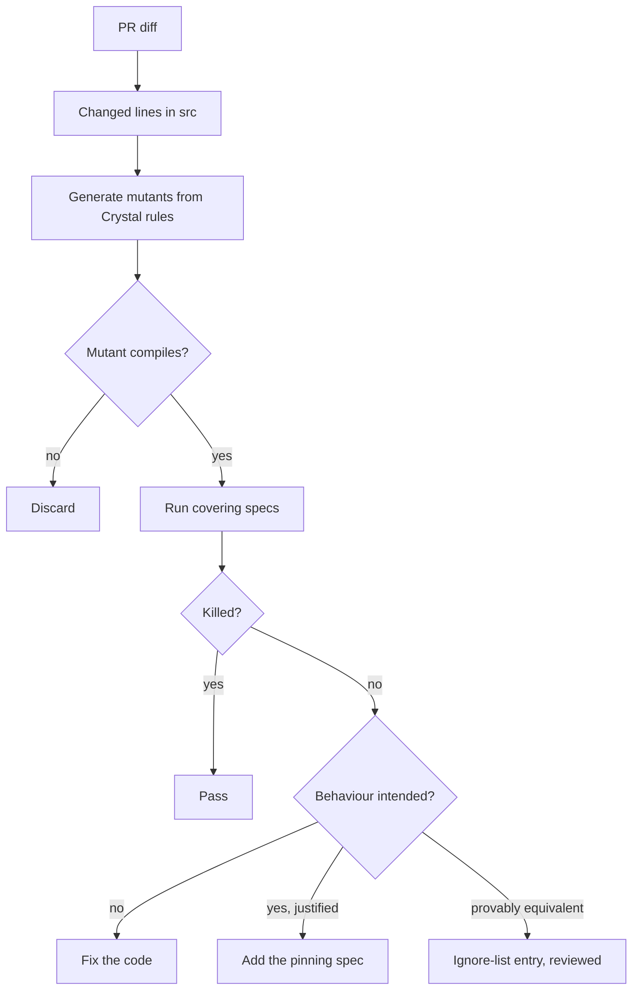
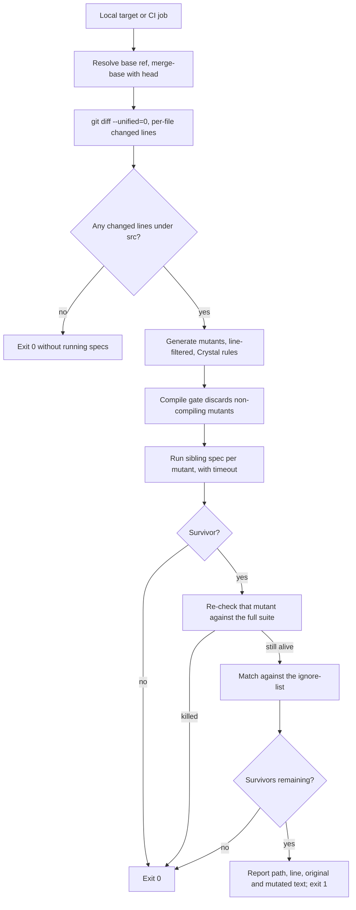

# Mutation Score Gate - Plan

## Goal Capsule

- **Objective:** A spec that executes a line without pinning its behaviour fails the build, the same way an uncovered line does today.
- **Means:** A diff-scoped mutation-score gate in CI, driven by a pinned language-agnostic mutator and a repo-owned Crystal rules file (KTD2).
- **Authority:** The Product Contract wins on product behaviour; a KTD wins on implementation mechanism inside its cited requirements; a unit overrides neither. The gate governs `src/**/*.cr` and the specs covering it.
- **Stop conditions:** Stop and ask if the `valid_glob?` fix would change how an existing convention doc under `docs/conventions/` is classified, or if the gate's measured PR runtime exceeds ten minutes on a typical diff.
- **Execution profile:** Tooling and CI work with one behavioural fix. U5 is test-first; the rest are verified by their own bats suites and by the gate running against itself.
- **Tail:** Backfilling `src/` to a repo-wide 100% is sequenced here but lands as follow-up PRs, not in this plan's diff.

---

## Product Contract

### Summary

Add a mutation-score gate that blocks a PR when a mutant survives on the lines that PR changed, and backfill `src/` to a repo-wide 100% mutation score over time. A survivor is treated as a suspected bug until the agent can justify the current behaviour, so the gate cannot be cleared by pinning whatever the code happens to do.

### Problem Frame

Most of the code in this repo is written by an agent, and so are its specs. That makes the 100% line-coverage gate weaker than it looks: coverage measures whether a line ran, and an agent optimising for a green gate can satisfy it with a spec that executes the line and asserts nothing about the result. The gate reports 100% and the behaviour is unpinned.

This is not hypothetical here. `src/agent_apropos/matcher.cr:43` sits inside `valid_glob?`, has been at 100% coverage since it was written, and contains a bug: the function reports `"!["` as a valid glob and `"[abc"` as invalid, though both are unterminated brackets. The `gsub` sample trick exists to stop `File.match?` from short-circuiting before it reaches the malformed part of a pattern, and it only half-works — the substituted sample can still mismatch on the first character, and the parser returns before it ever sees the `[`. A mutation run surfaced this in 34 seconds. No amount of line coverage would have.

The repo already tried to close this gap. `docs/mutation-testing.md` records a July 2026 spike on crytic, and `make mutate` has been wired since, but `docs/mutation-testing.md` has not been touched since the rename commits, no commit in the last 88 mentions a mutant or a survivor, and `.crytic/bin/crytic` still carries its build timestamp from the spike. The tool is also unmaintained upstream and compiles against the Crystal toolchain, which is the same coupling that currently breaks `spec/tool/comment_block_spec.cr` locally whenever the devcontainer's Crystal runs ahead of the 1.20.3 pin in `.github/workflows/ci.yml`.

### Key Decisions

- **A survivor is a suspected bug, not a missing assertion** (session-settled: user-directed — chosen over mechanically pinning current behaviour: pinning is the cheapest path to green and would have frozen the `valid_glob?` bug into the suite). Governs R9, R10.
- **Enforce on the diff now; backfill `src/` to 100% separately** (session-settled: user-directed — chosen over diff-only forever or a fixed core-module set: reaches a repo-wide standard without a multi-hour per-PR gate). Governs R5, R7.
- **CI blocks; a convention doc points the agent at a local target** (session-settled: user-directed — chosen over adding the gate to `make check`: keeps the fast local gate fast). Governs R6, R12, R13.
- **The engine arrives as a pinned pip install** (session-settled: user-directed — chosen over vendoring the package or writing our own driver: conventional, and upstream fixes stay one version bump away). Governs R1.
- **Retire crytic** (session-settled: user-directed — chosen over keeping the working `make mutate` wiring: it is unmaintained and compiles against the Crystal toolchain). Governs R4.
- **Use a foreign operator set rather than one we author.** A 100% score against operators we designed ourselves attests to less, because the same blind spot shapes the code and the operators. Governs R2.
- **Do not use comby.** Its language table has no Crystal matcher, so `.cr` would fall back to `.generic` and lose the structural precision that is the only reason to reach for it; its last release is 1.8.1 from June 2022. Governs R2.

### Actors

- A1. **Coding agent** — writes the code and its specs, runs the local target, and resolves survivors.
- A2. **Maintainer** — reviews survivor justifications and ignore-list entries in the PR.
- A3. **CI** — runs the blocking gate on the changed lines.

### Requirements

**Engine and packaging**

- R1. The mutation engine is installed from PyPI at an exact pinned version through a hash-locked requirements file, in CI and in the devcontainer image.
- R2. A repo-owned Crystal rules file supplies the mutation operators by transliterating the engine's shipped operator sets into Crystal syntax, so generated mutants are Crystal-valid rather than the C-shaped output the stock universal rules produce. Adding or removing an operator class is a reviewed change, not an implementation choice.
- R3. A compile check runs before any spec does, and discards mutants that do not compile.
- R4. `make mutate`, `CRYTIC_VERSION`, the `.crytic/` bootstrap, and the crytic sections of `docs/mutation-testing.md` are removed.

**Scope of the gate**

- R5. A gate run generates mutants only for source lines the change touched, except where R17 widens the scope.
- R6. The gate fails the build when any mutant survives the lines the run selected, and runs as a blocking CI check on pull requests.
- R7. Existing `src/` code is brought to a 100% mutation score by sweeps run outside the per-PR gate, one module at a time.
- R16. A checked-in list names the modules not yet backfilled, in the sequenced order, and a module leaves it only in the PR that brings it to a 100% mutation score.
- R17. A change to a backfilled module's spec file mutates that module in full, so deleting an assertion cannot pass a gate that only sees changed source lines.
- R8. The gate runs on the Ubuntu runner only; the Windows CI job is unchanged.
- R15. Every tracked source file either has a sibling spec file or a reviewed exemption entry, and a check fails when neither holds.

**Survivor handling**

- R9. Clearing a survivor by adding a spec requires a written justification that the current behaviour is intended, recorded as a comment on the pinning example; absent that, the code is fixed instead and the fix is named in the commit body.
- R10. A mutant shown to be equivalent is recorded in an ignore-list entry carrying its reason, and is reviewed like any other suppression.
- R11. The `valid_glob?` defect at `src/agent_apropos/matcher.cr:43` is fixed, and the four mutants that currently survive there are killed.

**Contributor and agent workflow**

- R12. A local target runs the same diff-scoped check a contributor or agent can run before pushing.
- R13. A convention doc under `docs/conventions/` triggers on spec and source edits and tells the agent to run that target, wired through the existing `agent-apropos hook pre`/`hook post` handlers in `.claude/settings.json`.
- R14. `docs/mutation-testing.md` is rewritten to describe the gate, the survivor rule, and the ignore-list policy.



### Key Flows

- F1. Gate run on a pull request
  - **Trigger:** A PR changes one or more lines under `src/`.
  - **Actors:** A1, A3
  - **Steps:** CI derives the changed lines; mutants are generated for those lines only; non-compiling mutants are discarded; the covering specs run against each survivor candidate; the job fails if any mutant survives.
  - **Outcome:** The PR is blocked until every mutant on the changed lines is killed, justified and pinned, or ignore-listed.
  - **Covers R3, R5, R6, R8**

- F2. Resolving a survivor
  - **Trigger:** A1 sees a surviving mutant, locally or in CI.
  - **Actors:** A1, A2
  - **Steps:** The runner has already re-checked the mutant against the full suite per KTD12, so what reaches A1 is a real survivor. A1 determines whether the mutated behaviour is wrong or merely unasserted; if the current behaviour cannot be justified, A1 fixes the code; if it can, A1 adds the pinning spec together with the justification; if the mutant cannot change observable behaviour at all, A1 adds an ignore-list entry. A2 reviews the justification or entry in the PR.
  - **Outcome:** The survivor is resolved in a way a reviewer can audit.
  - **Covers R9, R10, KTD12**

- F3. Backfill sweep
  - **Trigger:** A maintainer or agent picks a module not yet at 100%.
  - **Actors:** A1, A2
  - **Steps:** A full-file mutation run is executed outside the gate; each survivor goes through F2; the module lands at 100% in its own PR.
  - **Outcome:** `src/` converges on a repo-wide 100% mutation score without the per-PR gate ever paying full-sweep cost.
  - **Covers R7**

### Acceptance Examples

- AE1. **Covers R6, R9.** Given a PR that adds a function and a spec that calls it without asserting on the result, when the gate runs, then a mutant survives and the build fails.
- AE2. **Covers R9.** Given a survivor whose mutated behaviour is genuinely wrong, when the agent resolves it, then the source is corrected and the pre-existing spec suite is what catches the regression — no new assertion is added solely to turn the gate green.
- AE3. **Covers R10.** Given a mutant that provably cannot change observable behaviour, when the agent resolves it, then an ignore-list entry with a stated reason is added and the gate passes.
- AE4. **Covers R5.** Given a PR that touches only documentation, when the gate runs, then no mutants are generated and the job passes without running the spec suite.
- AE5. **Covers R11.** Given the current `valid_glob?`, when it is asked about `"!["` and `"[abc"`, then it returns the same verdict for both.

### Success Criteria

- The gate holds per R6, alongside the existing 100% line-coverage gate, with no standing exemptions beyond reviewed ignore-list entries.
- `src/` reaches a 100% mutation score through the backfill and stays there.
- A reviewer can tell from the PR alone which survivors were resolved by fixing code, which by pinning justified behaviour, and which by ignore-listing.
- `make check` keeps its current character as the fast local gate.

### Scope Boundaries

- Mutating spec assertions to find dead ones — a real idea aimed at a different failure mode (useless assertions rather than missing ones), and it could not have found the `valid_glob?` bug. Deferred.
- The local ameba/Crystal drift that breaks `crystal spec` when the devcontainer runs ahead of the CI pin. Separate work, though it limits full-suite mutation runs on a drifted machine.
- Mutation coverage of `tool/`, `spec/`, and `e2e/`. The gate governs `src/` only.
- Windows CI parity for the mutation job.
- comby, per the Key Decision declining it.

### Dependencies / Assumptions

- Python 3 and pip must be available where the gate runs. Python 3.12 is present in the devcontainer but pip is not — no `pip3`, no `pipx`, no `uv`, and `python3 -m venv` fails on ensurepip — so the devcontainer image needs a pip bootstrap.
- The regex path needs exactly one third-party module, `tabulate`. The `comby` and `Levenshtein` dependencies declared in universalmutator's `setup.py` are used only by the comby path and the mutant-ranking tools.
- Assumed: a typical PR diff keeps the gate inside a few minutes. Measured on `src/agent_apropos/matcher.cr` (56 lines): 145 raw mutants, ~1.06s per compile check, 16 survivors of that filter, ~2.2s per spec run. A Crystal rules file should cut the raw count sharply, but the per-PR runtime is unverified until R2 exists.
- Scoping each mutant's spec run to the sibling spec over-reports survivors and never under-reports them, because a mutant killed only by a non-sibling spec survives the narrower run. KTD12 removes that false failure by re-checking a reported survivor against the full suite.

### Outstanding Questions

**Deferred to Planning** — none remain; each is resolved in the Planning Contract below.

**Non-blocking**

- Making `valid_glob?` stricter changes lint behaviour for every repo consuming the released binary, not just this one. Whether that warrants a changelog note or a minor-version bump is a release-policy call, not an implementation one.

### Sources / Research

- `src/agent_apropos/matcher.cr:43` — the `valid_glob?` defect, found by mutation and confirmed by brute-forcing 2,959 glob patterns; all four surviving mutants diverge from the original on real inputs, so none is equivalent.
- `Makefile` — `CRYTIC_VERSION`, `MUTATION_TARGETS`, the `mutate` target, and the `.crytic/` bootstrap to be removed; `check` is the fast local gate the mutation run stays out of.
- `docs/mutation-testing.md` — the July 2026 crytic spike, its 100% MSI result on `src/agent_apropos/cli.cr`, and the manual-mutation fallback checklist.
- `.github/workflows/ci.yml` — Crystal pinned to 1.20.3 on both the Ubuntu and Windows jobs; the `plans` job added in fcf53ec keeps `docs/plans/` empty on main.
- `scripts/coverage.sh` — the existing 100% line-coverage gate this one sits beside.
- `tool/lint/main.cr` — precedent for repo-owned tooling built into `bin/`.
- universalmutator 1.14.1, released 2026-05-20 (https://github.com/agroce/universalmutator) — regex-rule mutation with a `--cmd` validity gate and `--lines` scoping; no coupling to any language toolchain.
- comby 1.8.1, released 2022-06-28 (https://github.com/comby-tools/comby) — language table covers Ruby, Elixir, Nim, Zig and ~40 others, but not Crystal.

---

## Planning Contract

Product Contract preservation: unchanged. No requirement was split, moved, or reworded during enrichment.

### Key Technical Decisions

- KTD1. Run each mutant against its module's sibling spec file, not the whole suite (session-settled: user-approved — chosen over a full-suite run per mutant: the sibling run is ~2.2s against a full-suite compile, and the error runs one way only, over-reporting survivors rather than missing them). Twenty-seven of the thirty-two tracked source files have a sibling today; U8 closes the gap so the mapping is total. Governs R5, R6.
- KTD11. Add the missing sibling specs rather than routing around them (session-settled: user-directed — chosen over a per-file spec-map override: an override leaves the gate's cost model resting on an untracked exception list, while a spec plus an enforced invariant keeps the mapping total). A file with no mutable construct is exempted, not given a vacuous spec. Governs R15.
- KTD12. Re-check a survivor against the full suite before failing the gate (session-settled: user-directed — chosen over widening the ignore list, treating it as a genuine survivor, or running the full suite per mutant: it removes the false failure without spending full-suite cost on the common path). A full-suite kill counts as killed. Governs R6.
- KTD13. Track backfill progress as a shrinking checked-in list rather than a schedule or a status report (session-settled: user-directed — chosen over a scheduled sweep job, a time-box, or dropping the repo-wide goal: removing a module from the list is the backfill PR, so progress is visible in the diff and cannot silently stall). Governs R7, R16.
- KTD2. Derive changed lines from `git diff --unified=0` against the merge-base of the PR base and head, as a per-file line set fed to the engine's line filter. Merge-base rather than the base tip keeps an out-of-date branch from mutating lines it did not touch. Governs R5.
- KTD3. Key ignore-list entries on source path, the original and mutated text, and the occurrence index of that text within the file. Mutant numbering shifts with rule order and line numbers shift with any edit above them, so neither is stable; the text pair alone is stable but not unique, and without the occurrence index one reviewed entry would exempt every identical line in the file. Governs R10.
- KTD4. Use a no-codegen build of the binary entry point as the compile gate. Measured at ~1.06s, against ~2.2s for a spec run, so filtering before running specs is the cheaper order. Governs R3.
- KTD5. Give every mutant spec run a timeout and count a timeout as killed. Mutating a loop bound or a guard can produce a non-terminating mutant, and an untimed gate hangs the job rather than failing it. Governs R6.
- KTD6. Ship no bypass switch (session-settled: user-approved — chosen over a skip label or env var: a reviewed ignore-list entry is the only escape, so bypassing leaves a reviewable artifact even when the gate itself is at fault). Governs R6, R10.
- KTD7. Give the gate its own CI job rather than bolting it onto `test`. Unlike the `plans` job it needs the Crystal toolchain, but it does not need kcov, Node, or the coverage run, and a separate job keeps its failure legible. Governs R6, R8.
- KTD8. Fix `valid_glob?` so an unterminated bracket is invalid regardless of what precedes it. The current sample-substitution trick fails when the substituted sample mismatches before the parser reaches the malformed region; the fix must make the validity verdict independent of where matching stops. Governs R11.
- KTD9. Sequence the backfill as the five pure-logic modules first — `matcher`, `frontmatter`, `index`, `session_state`, `review` — then the remainder by ascending file size. The logic modules are where a surviving mutant most likely means a real defect, and small files give early evidence on the real survivor rate. Governs R7.
- KTD10. The convention doc advises and never gates. Hook code paths must fail open per the root instruction file, so the doc tells the agent to run the local target; enforcement stays in CI. Governs R13.

### High-Level Technical Design

The runner is one script with a short pipeline. Both the local target and the CI job enter at the same point, so a contributor sees exactly what CI will see.



### Output Structure

```text
scripts/mutate.sh              # the runner; same entry point locally and in CI
tool/mutate/requirements.txt   # hash-locked engine pin
tool/mutate/crystal.rules      # repo-owned mutation operators
tool/mutate/ignore.txt         # reviewed equivalent-mutant entries
tool/mutate/no-spec.txt        # reviewed sibling-spec exemptions
tool/mutate/backfill.txt       # modules not yet at 100%, in sweep order
tests/mutate.bats              # runner behaviour, offline
tests/mutate_rules.bats        # rules behaviour, offline
docs/conventions/mutation.md   # edit-time guidance for the agent
```

### Assumptions

- Sibling naming is enforced rather than assumed, per R15. Five files lack a sibling today: `src/agent_apropos/rendering.cr` and `src/agent_apropos/agents/agent.cr` carry mutable logic and get specs in U8; `src/agent_apropos/check.cr` (a bare record), `src/agent_apropos/errors.cr` (an empty exception subclass), and `src/agent_apropos.cr` (the coverage gate's existing documented exclusion) carry no mutable construct and are exempted.
- PyPI is reachable during CI and devcontainer builds. The hash pin makes the resolved artifact deterministic but does not remove the network dependency.
- A Crystal rules file materially lifts the compile-gate pass rate above the ~11% the stock universal rules produced on `src/agent_apropos/matcher.cr`. Unverified until U2 lands; U2's verification measures it.

### Sequencing

U1 and U2 are independent and can land together. U3 needs both. U4 needs U3. U5 is independent of the tooling and can land first if the gate proves slow to stabilise. U6 and U7 are independent cleanups. U8 lands before U4 becomes blocking, so the gate never runs against a module whose sibling does not yet exist. The gate should not be made blocking until U6 is green, or the first PR after it lands fails on a known defect.

---

## Implementation Units

### U1. Pin and install the mutation engine

- **Goal:** `universalmutator` and `tabulate` are available at fixed versions in the devcontainer and on the CI runner.
- **Requirements:** R1
- **Dependencies:** none
- **Files:** `tool/mutate/requirements.txt`, `.devcontainer/Dockerfile`, `.github/workflows/ci.yml`
- **Approach:**
  1. Write a hash-locked requirements file pinning `universalmutator==1.14.1` and `tabulate`, the only third-party module the regex path imports.
  2. Add a pip bootstrap to the devcontainer image alongside the existing `python3` install in the kcov build stage.
  3. Install from the requirements file in the mutation CI job.
- **Patterns to follow:** the pinned-version-and-checksum style already used for the bats core and helper libraries in `.devcontainer/Dockerfile` and `.github/workflows/ci.yml`.
- **Test scenarios:** none — packaging only. Verified by the engine resolving in both environments.
- **Execution note:** This is packaging; prefer an install smoke check over unit coverage.
- **Verification:** The engine's entry points resolve in a fresh devcontainer build and in the CI job, at the pinned version.

### U2. Author the Crystal mutation rules

- **Goal:** Generated mutants are Crystal-valid, so the compile gate discards few of them.
- **Requirements:** R2
- **Dependencies:** U1
- **Files:** `tool/mutate/crystal.rules`, `tests/mutate_rules.bats`
- **Approach:**
  1. Transliterate the engine's shipped operator sets into Crystal syntax per R2 — adapt each operator's form, do not choose which operators exist.
  2. Where a shipped operator has a Crystal counterpart in different syntax, carry it across; statement-insertion mutations take their Crystal forms. Drop an operator class only where Crystal has no counterpart, and record the reason inline.
  3. Keep the rules file data-only; no driver logic lives here.
- **Patterns to follow:** the checklist in `docs/mutation-testing.md`; the rules-file syntax shipped with the engine.
- **Test scenarios:**
  - Generating against a fixture containing `&&`, `||`, `<`, `<=`, `==`, `!=` produces the flipped counterpart for each.
  - Generating against a fixture containing a `return` guard produces a guard-removal mutant.
  - No generated mutant for any fixture contains `break;` or `continue;`.
  - The compile-gate pass rate on `src/agent_apropos/matcher.cr` exceeds 50%, against the 11% the stock rules produced.
  - Every operator class the engine ships is either present in the rules file or carries an inline reason for its absence.
- **Verification:** The measured pass rate is recorded and beats the stock-rules baseline.

### U3. Diff-scoped runner and ignore-list

- **Goal:** One script decides pass or fail for the changed lines, locally and in CI, and honours reviewed ignore-list entries.
- **Requirements:** R3, R5, R6, R10, R12, R16, R17
- **Dependencies:** U1, U2
- **Files:** `scripts/mutate.sh`, `tool/mutate/ignore.txt`, `tool/mutate/backfill.txt`, `tests/mutate.bats`, `Makefile`
- **Approach:**
  1. Resolve the base ref and compute per-file changed lines per KTD2.
  2. Exit 0 before any generation when no changed line falls under `src/`.
  3. Generate line-filtered mutants with the compile gate per KTD4, then run the sibling spec per mutant with a timeout per KTD1 and KTD5.
  4. Run each selected spec target once against unmutated source first, and abort with a distinct error if it does not pass.
  5. Re-check each reported survivor against the full suite per KTD12; a full-suite kill counts as killed.
  6. Match what still survives against `tool/mutate/ignore.txt` using the key in KTD3, and report the rest with path, line, and the original and mutated text.
  7. Read `tool/mutate/backfill.txt` per KTD13, report which modules remain un-backfilled, and per R17 mutate a backfilled module in full when its spec file changed.
  8. Add the local `make` target that invokes the same script.
- **Patterns to follow:** `scripts/check-plans-empty.sh` for the `set -euo pipefail` shape, repo-root resolution, and the stderr error block; the existing bats suites for offline test structure.
- **Test scenarios:**
  - Covers AE4. A diff touching only documentation exits 0 without invoking the spec runner.
  - Covers AE1. A diff whose spec calls a function without asserting on the result exits non-zero and names the surviving mutation.
  - Covers AE3. A survivor matching an ignore-list entry exits 0.
  - A diff that only deletes lines exits 0.
  - A newly added file has every line treated as changed.
  - An ignore-list entry whose original text no longer appears in the file is reported as stale rather than silently ignored.
  - A mutant whose spec run exceeds the timeout is counted as killed.
  - The source file is restored when the runner is interrupted mid-run.
  - A module with no sibling spec file falls back to the full suite.
  - A mutant that survives its sibling spec but is killed by the full suite is scored killed, not reported.
  - A backfill-list entry naming a module that no longer exists is reported as stale.
  - A spec target that fails on unmutated source aborts the run with a distinct error rather than scoring every mutant killed.
  - An ignore-list entry matching a line that appears twice suppresses only the reviewed occurrence and reports the other.
  - A PR that changes only a backfilled module's spec file mutates that module in full.
  - A PR that changes only an un-backfilled module's spec file generates no mutants.
  - The runner invoked with no pull-request base ref exits with a distinct error rather than an empty line set.
- **Verification:** The bats suite passes offline, and running the target against a deliberately weakened spec fails with a legible report.

### U4. Blocking CI job

- **Goal:** The gate runs on every pull request and blocks the build on a surviving mutant.
- **Requirements:** R6, R8
- **Dependencies:** U3
- **Files:** `.github/workflows/ci.yml`
- **Approach:**
  1. Add a `mutation` job on the Ubuntu runner, pinned to the same Crystal version as `test`, per KTD7.
  2. Gate the job on the pull-request event; the workflow also fires on push to the default branch, where no pull-request base ref exists for KTD2's merge-base.
  3. Check out with enough history for the merge-base computation KTD2 needs.
  4. Add the job to the required status checks for the default branch, as a repo-settings step taken once U5 is green.
  5. Leave the Windows job untouched.
- **Patterns to follow:** the `plans` and `docs-links` jobs for the standalone-job shape, pinned action SHAs, and `persist-credentials: false`.
- **Test scenarios:** none — CI configuration. Verified by the job's own runs.
- **Verification:** The job passes on a clean PR, fails on a PR carrying a known survivor, is listed as a required check on the default branch, and does not run on push to that branch.

### U5. Fix `valid_glob?` and kill its survivors

- **Goal:** `valid_glob?` gives the same verdict for unterminated brackets regardless of what precedes them, and the four known survivors die.
- **Requirements:** R11
- **Dependencies:** none
- **Files:** `src/agent_apropos/matcher.cr`, `spec/agent_apropos/matcher_spec.cr`
- **Approach:** Apply KTD8. The validity verdict must not depend on where the matcher stops comparing.
- **Execution note:** Test-first. Write the failing example for `"!["` before touching the implementation.
- **Patterns to follow:** the existing example style in `spec/agent_apropos/matcher_spec.cr`.
- **Test scenarios:**
  - Covers AE5. `"!["` and `"[abc"` receive the same verdict.
  - `"[!a]"` remains valid — a negated character class is well-formed.
  - `"src/**"`, `"**/*.cr"`, and `"docs/**/*.md"` remain valid.
  - `"[a-z]*.cr"` remains valid.
  - Running the gate against this module reports zero survivors.
- **Verification:** Zero survivors on `src/agent_apropos/matcher.cr`, and no existing convention doc changes classification.

### U6. Retire crytic

- **Goal:** No crytic wiring, bootstrap, or documentation remains.
- **Requirements:** R4
- **Dependencies:** U3
- **Files:** `Makefile`, `.gitignore`, `docs/mutation-testing.md`
- **Approach:**
  1. Remove the `CRYTIC_VERSION` and `MUTATION_TARGETS` variables, the `.crytic/bin/crytic` bootstrap rule, and the old `mutate` target body.
  2. Keep the module list from `MUTATION_TARGETS` — KTD9 reuses it as the backfill order.
  3. Remove the `.crytic/` ignore entry.
- **Test scenarios:** none — removal. Verified by the searches in Verification.
- **Verification:** `make check` passes, and no occurrence of `crytic` remains anywhere in the tree.

### U7. Convention doc and documentation rewrite

- **Goal:** The agent is told to run the gate at edit time, and the mutation documentation describes the gate rather than the retired spike.
- **Requirements:** R9, R13, R14
- **Dependencies:** U3, U6
- **Files:** `docs/conventions/mutation.md`, `docs/mutation-testing.md`, `AGENTS.md`
- **Approach:**
  1. Add a convention doc scoped to source and spec paths, carrying the survivor rule R9 states and pointing at the local target. It advises only, per KTD10.
  2. Rewrite the mutation documentation to cover the gate, the survivor rule, the ignore-list policy, and the backfill order.
  3. Update the command list in the root instruction file.
  4. Regenerate the skill wrappers so the self-check drift gate stays green.
- **Patterns to follow:** the frontmatter and Rule/Why structure of `docs/conventions/specs.md`.
- **Test scenarios:**
  - Covers R13. Editing a file under `src/` surfaces the convention through the existing hook wiring.
  - The generated skill wrappers are byte-identical on a second run.
- **Verification:** `agent-apropos generate --check` and the repo's own lint pass; the documentation-link job passes.

### U8. Close the sibling-spec gap

- **Goal:** Every tracked source file has a sibling spec or a reviewed exemption, so the gate's spec selection is total rather than best-effort.
- **Requirements:** R15
- **Dependencies:** none
- **Files:** `spec/agent_apropos/rendering_spec.cr`, `spec/agent_apropos/agents/agent_spec.cr`, `tool/mutate/no-spec.txt`, `scripts/mutate.sh`, `tests/mutate.bats`
- **Approach:**
  1. Add a sibling spec for the rendering module, covering its truncation cap, its empty-input guard, and its separator joining directly rather than through the doctor path that reaches it today.
  2. Add a sibling spec for the agent base class, driving its concrete methods through a minimal test-double subclass.
  3. Record the three declaration-only files as exemption entries, each carrying its reason.
  4. Make the runner fail when a tracked source file has neither a sibling nor an entry.
- **Execution note:** Both new specs cover code the suite already reaches indirectly, so write them against observable behaviour rather than moving existing examples out of the specs that currently exercise it — line coverage must not drop.
- **Patterns to follow:** the example style in `spec/agent_apropos/matcher_spec.cr`; the reviewed-exclusion comment style in `scripts/coverage.sh`.
- **Test scenarios:**
  - The rendering module truncates at its character cap and returns empty for empty input.
  - The rendering module joins multiple documents with its separator and labels each with its path.
  - The agent base class appends the outside-repo flag only when that option is set.
  - The agent base class recognises a hook group by command prefix, and rejects a group whose hooks array is absent or malformed.
  - A tracked source file with neither a sibling spec nor an exemption entry fails the check.
  - An exemption entry naming a file that no longer exists is reported as stale.
- **Verification:** The check passes across the current tree, line coverage stays at 100%, and a mutation run against both new modules reports zero survivors.

---

## Verification Contract

| Gate | Command | Applies to |
|---|---|---|
| Fast local gate | `make check` | U1-U8 |
| Spec suite | `crystal spec` | U5, U8 |
| Line coverage, 100% | `make coverage` | U5, U8 |
| Mutation gate | the new local target | U2-U5 |
| Runner behaviour | `bats tests/mutate.bats` | U3 |
| Rules behaviour | `bats tests/mutate_rules.bats` | U2 |
| Generated-output drift | `agent-apropos generate --check` | U7 |
| Documentation links | `npm run lint:docs` | U7 |

The gate's own exit criterion is measurable: zero surviving mutants on the changed lines, and a PR-time run under ten minutes on a typical diff.

---

## Definition of Done

Global:

- Every requirement R1-R17 is satisfied or explicitly deferred in Scope Boundaries.
- Every tracked source file has a sibling spec or a reviewed exemption entry.
- `make check` and the full CI matrix, Windows included, pass.
- Line coverage stays at 100%.
- The mutation gate blocks a PR carrying a known survivor and passes a clean one, and is a required status check on the default branch.
- No occurrence of `crytic` remains in the tree.
- Abandoned or experimental code from approaches that did not pan out is removed, not left in the diff.
- `docs/plans/2026-08-23-1151-feat-mutation-score-gate-plan.md` is deleted in the PR that lands the work, per the plans gate.

Per unit: the unit's Verification line holds, and its test scenarios are implemented as real tests rather than described.

---

## Risks & Dependencies

- **A new file puts its whole module through the gate at once.** Every line of an added file counts as changed, so adding a large module pays full-file mutation cost in one PR. This is the standard working as intended, but it front-loads cost onto exactly the work most likely to be under time pressure. Mitigation: KTD9's ordering gives real survivor-rate data before the gate is made blocking.
- **The `valid_glob?` fix ships to downstream consumers.** agent-apropos is released as a binary, so a stricter validity check changes lint behaviour in every repo using it, not just this one. No convention doc in this repo is affected; external ones may be. See the non-blocking Outstanding Question.
- **PyPI is a build-time dependency.** The hash pin makes the artifact deterministic, not the fetch. A PyPI outage reds the mutation job.
- **Upstream is one maintainer.** `universalmutator` has no Crystal coupling, so a stalled upstream costs nothing until a bug bites. Vendoring stays available as a fallback and needs no design change.
- **An interrupted local run can leave a mutant in the working tree.** The engine restores the source in a `finally`, which a hard kill bypasses. U3's test scenario covers the interrupt path; a `git status` check before commit is the backstop.

---

## System-Wide Impact

- **CI time.** One new job on the Ubuntu runner, parallel to `test`, so wall-clock impact is bounded by the slowest existing job unless the mutation run exceeds it.
- **Devcontainer image.** A pip bootstrap and two pure-Python packages.
- **Released binary behaviour.** U5 changes `valid_glob?` output for a class of malformed patterns, which is a user-visible lint change for downstream repos.
- **Agent workflow.** A new convention fires on source and spec edits, adding to the context injected at edit time.
